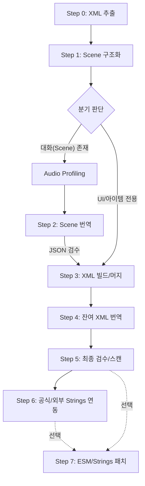

# Starfield Translation Automation 프로젝트 지식 문서

## 1. 프로젝트 개요 및 목적

이 프로젝트는 Starfield 모드 플러그인(`.esm`, `.esp`)의 문자열을 추출하고, AI(LLM)를 활용하여 고품질의 한국어 번역을 자동 수행하며, 최종적으로 모드에 적용 가능한 xTranslator 호환 XML 및 관련 파일을 생성하는 자동화 파이프라인이다.

현재 프로젝트는 기존 **Python 기반 Prototype(`SFTranslator`)**에서 **Node.js/Electron 기반 Desktop App(`SFTranNode`)**으로 전환 및 고도화되는 과정에 있다.

### 주요 기능
- **ESM/ESP 레코드 파싱**: 성격이 다른 다양한 레코드에서 번역 가능한 텍스트 추출.
- **Scene 기반 번역**: 단순 문자열 나열이 아닌, 퀘스트와 대사 구조를 파악하여 문맥에 맞는 번역 수행.
- **오디오 프로파일링**: 실제 게임 내 음성 데이터를 분석하거나 텍스트 성격에 기반해 화자의 말투(페르소나) 정의.
- **LLM 오케스트레이션**: Vertex AI, OpenAI, 1min.ai 등 다양한 모델을 역할별(번역, 검수, 프로파일링)로 라우팅.
- **RAG 기반 일관성 유지**: SQLite DB를 활용한 용어집(Glossary) 및 번역 메모리(TM) 연동.
- **자동 검수 및 보정**: 태그 손상 방지, 미번역 문자열 감지 및 재번역 수행.

---

## 2. 프로젝트 구조 (Dual-Stack)

### [Prototype] SFTranslator (Python)
- **성격**: 핵심 로직의 검증 및 초기 파이프라인 수립용.
- **핵심 파일**:
  - `auto_pipeline.py`: 단계별 CLI를 호출하는 오케스트레이터.
  - `llm_backend.py`: 다중 LLM 지원 추상화 레이어.
  - `step0` ~ `step7`: 실제 작업을 수행하는 독립적인 CLI 스크립트들.
  - `main_gui.py`: PyQt6 기반의 초기 GUI.

### [Production] SFTranNode (Node.js/Electron)
- **성격**: 사용자 편의성 강화 및 실제 배포용 데스크톱 애플리케이션.
- **기술 스택**: Electron, Vite, TypeScript, React(Tailwind CSS/Airbnb Design System).
- **진척 상황**: Python 기반의 Step 0~6 로직이 TypeScript로 모두 포팅 완료되었으며, 통합 테스트 및 UI 고도화 단계임.

---

## 3. 핵심 파이프라인 흐름 (Step 0 ~ 6)

모든 작업은 `Input Mod` 하나를 기준으로 시작되며, 내부 문자열 구성에 따라 자동으로 분기된다.

### 상세 단계 설명
1.  **Step 0 (Extract)**: 원본 바이너리에서 xTranslator 호환 XML을 생성.
2.  **Step 1 (Structure)**: 퀘스트-씬-대사 간의 계층 구조를 JSON으로 추출.
3.  **Audio Profiling**: 음성 파일을 분석하여 화자의 인격과 말투를 정의 (Translation Persona 생성).
4.  **Step 2 (Scene Translation)**: 프로파일을 기반으로 JSON 형태의 대사 데이터를 번역.
5.  **Step 3 (Build/Merge)**: 원본 XML 구조에 번역된 Scene 데이터를 주입.
6.  **Step 4 (General Translation)**: Scene에 포함되지 않은 UI, 아이템 이름 등을 번역.
7.  **Step 5 (Review/Fix)**: 태그 오류, 미번역본을 스캔하고 선택적으로 교정.
8.  **Step 6 (Refine)**: 외부 번역본이나 공식 Strings 데이터를 참조하여 최종 보정.
9.  **Step 7 (ESM Builder)**: xTranslator 등 외부 도구 없이 100% Python 네이티브로 다국어화(Localized) 구조를 판단하여 `.strings` 파일을 빌드하거나, 원본 ESM 바이너리에 직접 번역본을 주입.

---

## 4. 최근 주요 기술적 해결 사항 (2026-04)

- **XML 속성 중복 정의 오류 해결**: `step5_review_xml.py`에서 계층형 JSON 구조를 순회할 때, 부모와 자식 간의 데이터 전파 오류로 인한 XML 파싱 에러를 수정.
- **자동 분기 로직(Branching) 안정화**: 모드 내에 Scene 데이터가 전혀 없는 경우에도 파이프라인이 멈추지 않고 바로 "Direct XML" 모드로 전환되도록 개선.
- **Python 네이티브 ESM 빌더 통합 (Step 7)**: xTranslator 버전에 종속되어 업데이트마다 에러가 발생하던 문제를 해결. `0x80` 로컬라이즈 플래그를 판단해 자동으로 `.strings` 파일 생성 혹은 메모리 AST(Abstract Syntax Tree) 파싱 기반 ESM/ESP 직접 주입을 지원하는 독자적 엔진 적용.
- **Node.js 포팅 완료**: `better-sqlite3`를 사용하여 DB 관리자를 구현하고, 기존 Python의 복잡한 로직(Scene 탐색, LLM 스트리밍 등)을 TS 환경으로 완전 이전.
- **프로세스 제어 강화**: GUI에서 작업 중단 시 자식 프로세스 트리를 강제 종료(`taskkill`)하여 불필요한 API 호출 및 리소스 점유 방지.
- **Resume 기능**: 파일 존재 여부와 Manifest를 대조하여 중단된 단계부터 이어서 시작하는 기능 구현.

---

## 5. 데이터 환경 및 설정

- **Database (`translation_db.sqlite`)**:
  - `glossary`: 고유 용어집.
  - `translation_memory`: 기번역된 문장 저장 (Fuzzy Match 지원).
  - `reference_strings`: 다른 언어(주로 일본어)나 이전 버전의 문자열 참조.
- **Configuration (`config.json`)**:
  - `models`: 역할별(Review, Translation, Profiling) 모델 라우팅 설정.
  - `game_data_dir`: Starfield 게임 데이터 및 BA2 파일 경로.
  - `api_keys`: 서비스 공급자별 API 키 관리.

---

## 6. 향후 과제 및 유지보수 가이드

- **공통 모듈화**: Python과 Node.js 간의 프롬프트 정의(`prompts.ts`, `prompts.py`)를 단일 소스로 관리하는 방안 검토.
- **UI UX 고도화**: Airbnb 디자인 시스템을 적용하여 전문가용 도구이면서도 직관적인 인터페이스 구축.
- **대규모 모드 성능 최적화**: 100만 라인 이상의 대형 모드(예: 대규모 퀘스트 모드) 처리 시 메모리 누수 방지 및 청크 단위 안정성 강화.

---

## 7. 빠른 참조 (주요 파일)

| 기능 | SFTranslator (Python) | SFTranNode (TS) |
| :--- | :--- | :--- |
| **전체 제어** | `auto_pipeline.py` | `src/steps/auto_pipeline.ts` |
| **추출 (Step 0)** | `step0_extract_xml.py` | `src/steps/step0_extract_xml.ts` |
| **Scene (Step 1)** | `step1_extract_scene.py` | `src/steps/step1_extract_scene.ts` |
| **번역/DB** | `db_manager.py` | `src/database/db_manager.ts` |
| **LLM** | `llm_backend.py` | `src/services/llm_backend.ts` |
| **ESM/Strings** | `step7_esm_builder.py` | `src/steps/step7_esm_builder.ts` |
| **UI** | `main_gui.py` | `src/renderer/` |

---
**마지막 업데이트**: 2026-04-22
